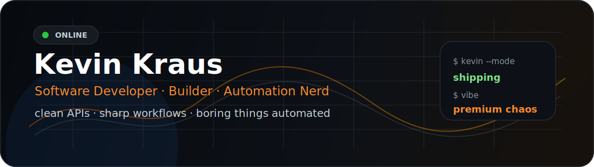
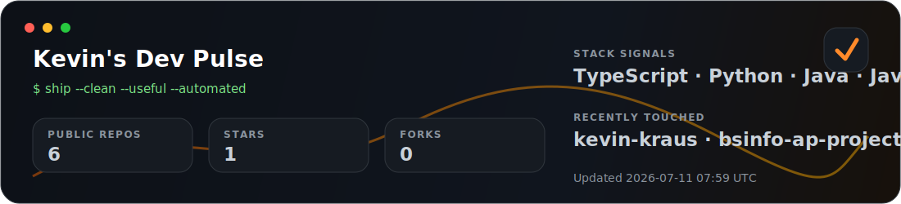

<!--
  GitHub Profile README for kevin-kraus
  Style: clean premium × creator attitude
-->

<div align="center">



<br />

[](https://git.io/typing-svg)

<br />

[](https://github.com/kevin-kraus)
[](YOUR_LINKEDIN_URL)
[](YOUR_WEBSITE_URL)
[](YOUR_INSTAGRAM_URL)

</div>

---

## `whoami`

Ich bin **Software Developer** mit Fokus auf Backend-Systeme, Cloud-Infrastruktur, Automatisierung und moderne Web-Apps.

Ich baue am liebsten Dinge, die echten Nutzen haben: APIs, interne Tools, Dashboards, Developer-Workflows, Automationen und Systeme, die zuverlässig laufen, ohne jeden Tag Aufmerksamkeit zu wollen.

Nebenbei betreibe ich **Kevin Kraus Media** — mein Side-Business für Foto- und Videografie.  
Das taucht hier nicht als Hauptrolle auf, aber es erklärt ziemlich gut, warum ich bei Software auch auf UX, Details und saubere Präsentation achte.

```txt
main quest:  software engineering
side quest:  media, cars, storytelling
special:     automate the boring parts
```

---

## Dev Pulse



> Wird täglich per GitHub Action aktualisiert und zieht sich aktuelle öffentliche GitHub-Daten von `kevin-kraus`.

---

## Was ich gerne baue

<table>
  <tr>
    <td width="50%">
      <h3>Backend & APIs</h3>
      <p>
        Saubere Services, klare Schnittstellen, nachvollziehbare Datenflüsse und Code,
        den man auch nach drei Monaten noch versteht.
      </p>
      <p>
        <code>Java</code> <code>Spring Boot</code> <code>REST</code> <code>JPA</code>
        <code>PostgreSQL</code>
      </p>
    </td>
    <td width="50%">
      <h3>Cloud & Automation</h3>
      <p>
        Deployments, Jobs, Serverless Workflows, Backups und Observability.
        Am besten so, dass man sie nicht ständig anfassen muss.
      </p>
      <p>
        <code>AWS</code> <code>CDK</code> <code>Lambda</code> <code>S3</code>
        <code>CloudWatch</code>
      </p>
    </td>
  </tr>
  <tr>
    <td width="50%">
      <h3>Frontend & Dashboards</h3>
      <p>
        Interfaces, die nicht nur funktionieren, sondern sich schnell und logisch anfühlen.
        Besonders gerne für Daten, Workflows und interne Tools.
      </p>
      <p>
        <code>TypeScript</code> <code>React</code> <code>Next.js</code>
        <code>Angular</code>
      </p>
    </td>
    <td width="50%">
      <h3>AI & Developer Workflows</h3>
      <p>
        Lokale LLMs, AI-gestützte Coding Workflows, Agenten, CLI-Tools und alles,
        was Entwicklungsarbeit schneller oder weniger nervig macht.
      </p>
      <p>
        <code>Ollama</code> <code>OpenCode</code> <code>GitHub Actions</code>
        <code>Automation</code>
      </p>
    </td>
  </tr>
</table>

---

## Tech Stack

<div align="center">

### Languages & Backend


### Frontend & Data


### Cloud, DevOps & Tools


</div>

---

## GitHub Metrics

<div align="center">


<br /><br />


</div>

---

## Contribution Snake

<div align="center">


</div>

---

## Meine Developer-Philosophie

```txt
Make it work.
Make it clean.
Make it observable.
Make it useful.
Then automate the boring part.
```

Ich mag keine Magie im Code, die nur funktioniert, solange niemand Fragen stellt.

Gute Software ist für mich:

```txt
verständlich
testbar
wartbar
deploybar
debuggbar
```

Und gute Tools sind die, bei denen man irgendwann vergisst, wie nervig das Problem vorher war.

---

## Beyond Code

```txt
media      -> Kevin Kraus Media, photo, video, editing, storytelling
cars       -> rolling shots, Nürburgring, automotive content
systems    -> NAS, backups, local AI, Home Assistant, smart home
```

Software ist mein Hauptding.  
Aber Kamera, Autos und Content sorgen dafür, dass ich Dinge nicht nur technisch, sondern auch visuell und praktisch denke.

---

## Kontakt

<div align="center">

[](https://github.com/kevin-kraus)
[](YOUR_LINKEDIN_URL)
[](YOUR_WEBSITE_URL)
[](YOUR_INSTAGRAM_URL)

</div>

---

<div align="center">

```txt
currently: building useful software and pretending the backlog is under control
```

</div>
